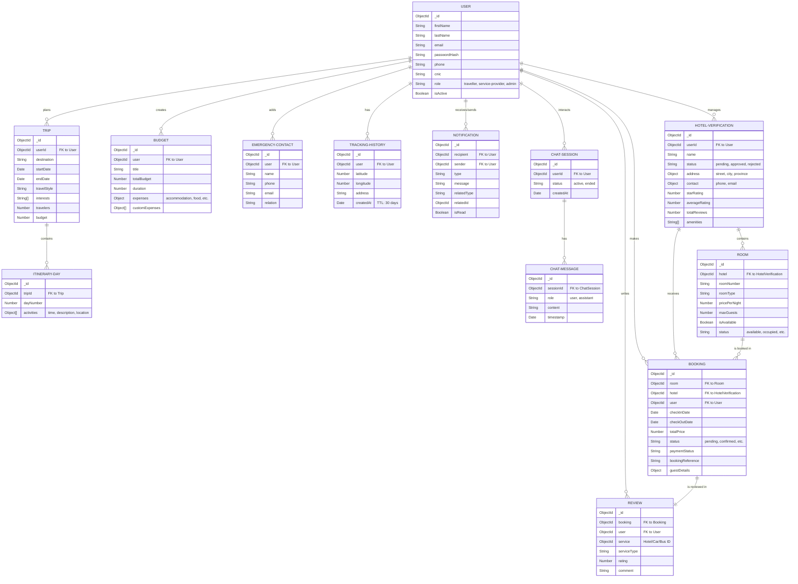

# Travel Companion Database Diagram

```mermaid
erDiagram
    USER ||--o{ HOTEL-VERIFICATION : "manages"
    USER ||--o{ BOOKING : "makes"
    USER ||--o{ REVIEW : "writes"
    USER ||--o{ BUDGET : "creates"
    USER ||--o{ EMERGENCY-CONTACT : "adds"
    USER ||--o{ TRACKING-HISTORY : "has"
    USER ||--o{ NOTIFICATION : "receives/sends"
    
    %% AI & Trip Planning %%
    USER ||--o{ TRIP : "plans"
    TRIP ||--o{ ITINERARY-DAY : "contains"
    USER ||--o{ CHAT-SESSION : "interacts"
    CHAT-SESSION ||--o{ CHAT-MESSAGE : "has"

    HOTEL-VERIFICATION ||--o{ ROOM : "contains"
    HOTEL-VERIFICATION ||--o{ BOOKING : "receives"
    
    ROOM ||--o{ BOOKING : "is booked in"
    
    BOOKING ||--|| REVIEW : "is reviewed in"

    USER {
        ObjectId _id
        String firstName
        String lastName
        String email
        String passwordHash
        String phone
        String cnic
        String role "traveller, service-provider, admin"
        Boolean isActive
    }

    TRIP {
        ObjectId _id
        ObjectId userId "FK to User"
        String destination
        Date startDate
        Date endDate
        String travelStyle
        String[] interests
        Number travelers
        Number budget
    }

    ITINERARY-DAY {
        ObjectId _id
        ObjectId tripId "FK to Trip"
        Number dayNumber
        Object[] activities "time, description, location"
    }

    CHAT-SESSION {
        ObjectId _id
        ObjectId userId "FK to User"
        String status "active, ended"
        Date createdAt
    }

    CHAT-MESSAGE {
        ObjectId _id
        ObjectId sessionId "FK to ChatSession"
        String role "user, assistant"
        String content
        Date timestamp
    }

    HOTEL-VERIFICATION {
        ObjectId _id
        ObjectId userId "FK to User"
        String name
        String status "pending, approved, rejected"
        Object address "street, city, province"
        Object contact "phone, email"
        Number starRating
        Number averageRating
        Number totalReviews
        String[] amenities
    }

    ROOM {
        ObjectId _id
        ObjectId hotel "FK to HotelVerification"
        String roomNumber
        String roomType
        Number pricePerNight
        Number maxGuests
        Boolean isAvailable
        String status "available, occupied, etc."
    }

    BOOKING {
        ObjectId _id
        ObjectId room "FK to Room"
        ObjectId hotel "FK to HotelVerification"
        ObjectId user "FK to User"
        Date checkInDate
        Date checkOutDate
        Number totalPrice
        String status "pending, confirmed, etc."
        String paymentStatus
        String bookingReference
        Object guestDetails
    }

    REVIEW {
        ObjectId _id
        ObjectId booking "FK to Booking"
        ObjectId user "FK to User"
        ObjectId service "Hotel/Car/Bus ID"
        String serviceType
        Number rating
        String comment
    }

    BUDGET {
        ObjectId _id
        ObjectId user "FK to User"
        String title
        Number totalBudget
        Number duration
        Object expenses "accommodation, food, etc."
        Object[] customExpenses
    }

    EMERGENCY-CONTACT {
        ObjectId _id
        ObjectId user "FK to User"
        String name
        String phone
        String email
        String relation
    }

    TRACKING-HISTORY {
        ObjectId _id
        ObjectId user "FK to User"
        Number latitude
        Number longitude
        String address
        Date createdAt "TTL: 30 days"
    }

    NOTIFICATION {
        ObjectId _id
        ObjectId recipient "FK to User"
        ObjectId sender "FK to User"
        String type
        String message
        String relatedType
        ObjectId relatedId
        Boolean isRead
    }
```
